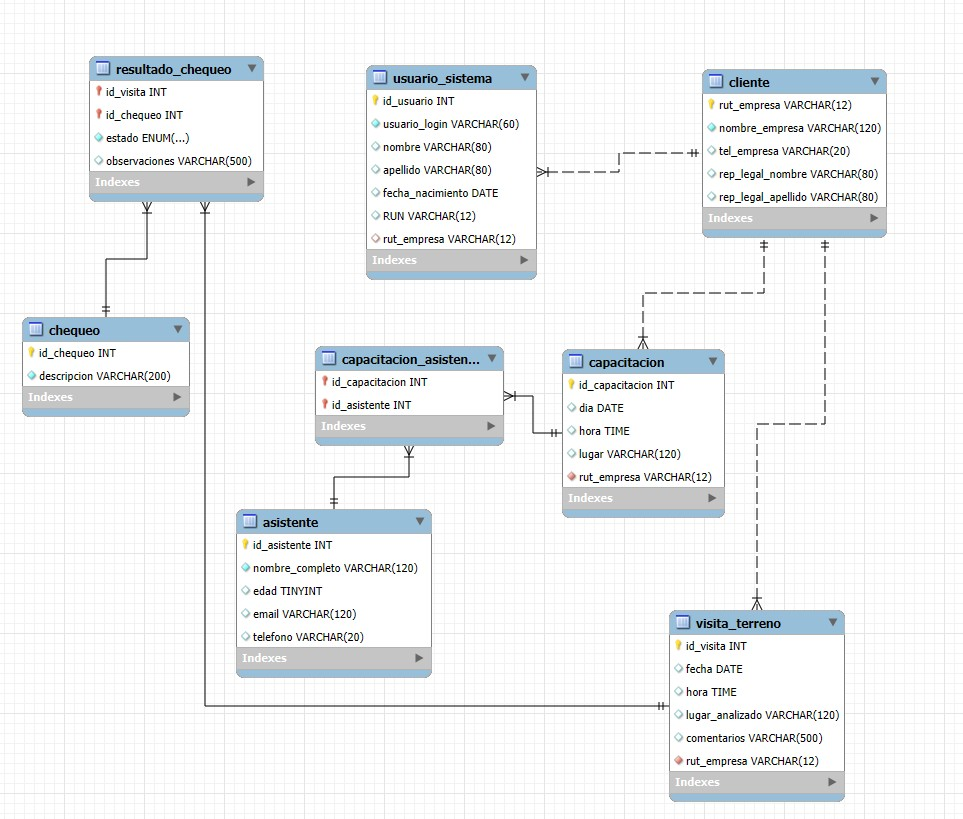

**_<h1 align="center">:vulcan_salute: Proyecto Empresa de Asesorías en Prevención de Riesgos :computer:</h1>_**

**<h3>:blue_book: Contexto:</h3>**

<p>Una empresa de asesorías en prevención de riesgos necesita contar con un sistema de información que le permita administrar los principales procesos que se llevan a cabo en ella día a día.</p>
<p>Esta empresa entrega asesoría a diversos clientes. De cada uno de ellos se necesita saber su RUT de la empresa, el nombre y apellido del representante legal, nombre de la empresa y el teléfono de la empresa cliente. A cada uno de estos clientes se le realizan visitas de forma regular; a cada visita en terreno se le asigna un número único de identificación, y se registra la fecha que se hace, la hora, el nombre del lugar que se analizó y comentarios relacionados con la visita.</p>
<p>En cada visita en terreno, la empresa de asesoría tiene un conjunto de chequeos que debe realizar, y por cada visita se debe registrar si ese chequeo se cumple, si se cumple con observaciones, o bien si no se cumple.</p>
<p>Además, la empresa de asesoría realiza capacitaciones a sus clientes, eventos de los que interesa saber el día, hora y lugar. Al mismo tiempo, se requiere saber que personas asistieron a dicha capacitación, almacenando su nombre completo, su edad, correo electrónico y teléfono.</p>
<p>Finalmente, a cada cliente se le ha habilitado un usuario de sistema, el cual será el medio para que la empresa cliente pueda acceder a la plataforma. Cada cliente tiene solo un usuario en sistema, y del usuario se almacena su nombre, apellido, la fecha de nacimiento y el RUN.</p>

**<h3>:orange_book: Requerimientos:</h3>**

<p>Con la información anterior debe crear un modelo entidad relación, estableciendo claramente:</p>
<ul>
  <li>Entidades (considerar los diversos tipos de entidades).</li>
  <li>Relaciones.</li>
  <li>Atributos (destaque atributos primarios, e indique la forma correcta según el tipo de atributo).</li>
</ul>

**<h3>:green_book: Pasos para implementar el proyecto:</h3>**

1. Crear el modelo entidad-relación (MER) utilizando una herramienta de diagramación, validando que se cumplan todos los requisitos. Debe incluir todas las entidades, relaciones y atributos necesarios.
2. Convertir el MER a un modelo relacional, definiendo las tablas, claves primarias y foráneas.
3. Implementar en MySQL creando las tablas y relaciones necesarias.

**<h3>📁 Estructura del Proyecto:</h3>**

<p>Proyecto Grupal desarrollado por:</p>
<ul>
  <li>Giorgio Interdonato</li>
  <li>Katherine Alderete</li>
  <li>Katrina González</li>
</ul>
<p>Generado en MySQL según modelo Crow’s Foot</p>

```
📁abpro_ae4_kagika
├── README.md
└── 📁img
│    └── eer_diagram.jpg
└── 📁mysql
    ├── eer_diagram.mwb
    └── todas_las_tablas.sql
```

**<h3>:blue_book: Construcción Base de Datos:</h3>**

```SQL
-- 1. CLIENTE
CREATE TABLE cliente (
    rut_empresa VARCHAR(12) PRIMARY KEY,
    nombre_empresa VARCHAR(120) NOT NULL,
    tel_empresa VARCHAR(20),
    rep_legal_nombre VARCHAR(80),
    rep_legal_apellido VARCHAR(80)
);
```

```SQL
-- 2. USUARIO_SISTEMA
CREATE TABLE usuario_sistema (
    id_usuario INT AUTO_INCREMENT PRIMARY KEY,
    usuario_login VARCHAR(60) UNIQUE NOT NULL,
    nombre VARCHAR(80),
    apellido VARCHAR(80),
    fecha_nacimiento DATE,
    RUN VARCHAR(12),
    rut_empresa VARCHAR(12) UNIQUE,
    CONSTRAINT fk_usuario_cliente FOREIGN KEY (rut_empresa) REFERENCES cliente(rut_empresa)
        ON DELETE CASCADE ON UPDATE CASCADE
);
```

```SQL
-- 3. VISITA_TERRENO
CREATE TABLE visita_terreno (
    id_visita INT AUTO_INCREMENT PRIMARY KEY,
    fecha DATE,
    hora TIME,
    lugar_analizado VARCHAR(120),
    comentarios VARCHAR(500),
    rut_empresa VARCHAR(12) NOT NULL,
    CONSTRAINT fk_visita_cliente FOREIGN KEY (rut_empresa) REFERENCES cliente(rut_empresa)
        ON DELETE CASCADE ON UPDATE CASCADE
);
```

```SQL
-- 4. CHEQUEO
CREATE TABLE chequeo (
    id_chequeo INT AUTO_INCREMENT PRIMARY KEY,
    descripcion VARCHAR(200) NOT NULL
);
```

```SQL
-- 5. RESULTADO_CHEQUEO (tabla asociativa Visita ↔ Chequeo)
CREATE TABLE resultado_chequeo (
    id_visita INT NOT NULL,
    id_chequeo INT NOT NULL,
    estado ENUM('cumple','con_observaciones','no_cumple') NOT NULL,
    observaciones VARCHAR(500),
    PRIMARY KEY (id_visita, id_chequeo),
    CONSTRAINT fk_result_visita FOREIGN KEY (id_visita) REFERENCES visita_terreno(id_visita)
        ON DELETE CASCADE ON UPDATE CASCADE,
    CONSTRAINT fk_result_chequeo FOREIGN KEY (id_chequeo) REFERENCES chequeo(id_chequeo)
        ON DELETE CASCADE ON UPDATE CASCADE
);
```

```SQL
-- 6. CAPACITACION
CREATE TABLE capacitacion (
    id_capacitacion INT AUTO_INCREMENT PRIMARY KEY,
    dia DATE,
    hora TIME,
    lugar VARCHAR(120),
    rut_empresa VARCHAR(12) NOT NULL,
    CONSTRAINT fk_cap_cliente FOREIGN KEY (rut_empresa) REFERENCES cliente(rut_empresa)
        ON DELETE CASCADE ON UPDATE CASCADE
);
```

```SQL
-- 7. ASISTENTE
CREATE TABLE asistente (
    id_asistente INT AUTO_INCREMENT PRIMARY KEY,
    nombre_completo VARCHAR(120) NOT NULL,
    edad TINYINT,
    email VARCHAR(120),
    telefono VARCHAR(20)
);
```

```SQL
-- 8. CAPACITACION_ASISTENTE (tabla asociativa Capacitacion ↔ Asistente)
CREATE TABLE capacitacion_asistente (
    id_capacitacion INT NOT NULL,
    id_asistente INT NOT NULL,
    PRIMARY KEY (id_capacitacion, id_asistente),
    CONSTRAINT fk_capasist_cap FOREIGN KEY (id_capacitacion) REFERENCES capacitacion(id_capacitacion)
        ON DELETE CASCADE ON UPDATE CASCADE,
    CONSTRAINT fk_capasist_asist FOREIGN KEY (id_asistente) REFERENCES asistente(id_asistente)
        ON DELETE CASCADE ON UPDATE CASCADE
);
```

**<h3>:book: EER Diagram:</h3>**


